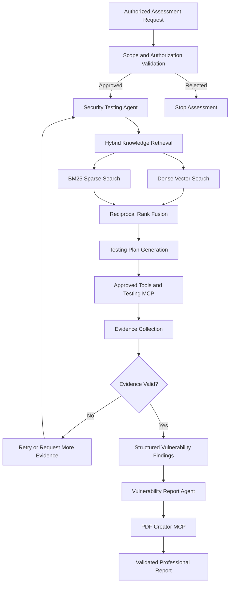
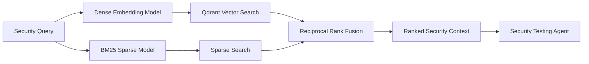

<div align="center">

<a href="https://git.io/typing-svg">
  
</a>

<br/>

[](https://www.linkedin.com/in/mohamed-asam-733768203/)
[](https://asamsm.vercel.app/)
[](https://github.com/Asam8385)
[](mailto:asam.engen8385@gmail.com)

<br/>


📍 Colombo, Sri Lanka

</div>

---

## 👨‍💻 About Me

I am an **Agentic AI Developer and Python Engineer** focused on designing intelligent systems that can retrieve knowledge, reason through tasks, use external tools, validate results, and produce structured outputs.

My current work focuses on:

- Building stateful multi-agent applications with **LangGraph**
- Developing LLM-powered workflows using **LangChain**
- Integrating models through **Azure AI Foundry**
- Creating hybrid RAG systems using dense embeddings, BM25, RRF, and Qdrant
- Connecting agents to external capabilities through **Model Context Protocol**
- Serving production-oriented AI workflows through asynchronous **FastAPI**
- Creating structured agent communication using **Pydantic**
- Developing computer-vision systems using CNNs, OpenCV, and ROS

I am particularly interested in AI systems where agents do more than generate text—they retrieve trusted context, execute approved actions, validate technical evidence, and produce useful real-world results.

> 🔐 Current focus: Building scope-controlled AI agents for authorized vulnerability assessment and professional security reporting.

---

## 🧠 AI Engineering Profile

```python
agentic_ai_developer = {
    "agent_orchestration": [
        "LangGraph",
        "LangChain",
        "Stateful Workflows",
        "Multi-Agent Systems",
    ],
    "retrieval": [
        "Hybrid RAG",
        "Dense Embeddings",
        "BM25",
        "Reciprocal Rank Fusion",
        "Qdrant",
    ],
    "model_platforms": [
        "Azure AI Foundry",
        "Azure OpenAI",
        "Hugging Face",
    ],
    "tool_integration": [
        "Model Context Protocol",
        "Structured Tool Calling",
        "External Function Execution",
    ],
    "ai_backend": [
        "FastAPI",
        "Pydantic",
        "AsyncIO",
        "Server Lifespan Management",
    ],
    "applied_ai": [
        "Computer Vision",
        "CNNs",
        "OpenCV",
        "ROS",
    ],
}
```

---

## 💼 Professional Experience

### 🤖 Agentic AI Developer — UOWN

**Feb 2026 – Aug 2026 · Dubai · Remote**

Built an AI-powered vulnerability assessment assistant for approved and authorized domains.

- Designed a sequential multi-agent workflow using **LangGraph**
- Created a security-testing agent for retrieval, planning, tool execution, and evidence collection
- Developed a reporting agent for converting validated evidence into structured vulnerability reports
- Built a hybrid retrieval pipeline combining dense embeddings, BM25, RRF, and Qdrant
- Integrated LLM capabilities through **Azure AI Foundry**
- Designed MCP integrations for security-testing tools and PDF report generation
- Implemented typed workflow state and agent handoffs using Pydantic
- Added target-scope and authorization validation before tool execution
- Created evidence-validation and retry stages to reduce unsupported findings
- Exposed the workflow through asynchronous FastAPI endpoints
- Kept dense and sparse embedding models loaded throughout the server lifecycle
- Generated structured findings and professional PDF security reports

The system can operate as an AI security assistant or automate approved vulnerability-discovery workflows while enforcing authorization and target-scope controls.

---

### 🚗 Python Developer — VEGA

**Feb 2025 – Dec 2025 · Sri Lanka · Remote**

Worked on Level 2 autonomous-driving and driver-assistance capabilities.

- Developed and deployed CNN-based models as ROS nodes
- Implemented lane-detection pipelines using OpenCV and image-processing techniques
- Created lane-direction detection to support cruise-control functionality
- Built real-time image-processing pipelines for autonomous-driving scenarios
- Integrated vision-model outputs with ROS-based components
- Tested and improved perception accuracy under different road conditions
- Contributed to an applied AI system combining machine learning, vision, and robotics

---

### 🧪 Associate Software Engineer — Data and R&D — PickMe

**Jun 2024 – Jan 2025 · Sri Lanka · On-site**

- Developed Python and Go services for research-oriented and production use cases
- Built and maintained backend APIs and reusable software components
- Worked with asynchronous and distributed processing patterns
- Participated in technical research, experimentation, debugging, and optimization
- Collaborated on scalable software solutions for real-world systems

---

### 🐍 Python Developer Intern — Octopus BI

**Jan 2024 – May 2024 · Sri Lanka · Remote**

- Developed Python automation and backend components
- Implemented reusable modules and service integrations
- Worked with API integrations, validation, debugging, and testing
- Contributed to maintainable Python-based applications

---

## 🔐 Featured Agentic AI Project

### AI-Powered Vulnerability Assessment System

A scope-controlled multi-agent application for retrieving security knowledge, performing approved vulnerability checks, validating technical evidence, and generating professional reports.

#### Core capabilities

- Validates the authorized assessment scope before execution
- Retrieves relevant security knowledge through hybrid search
- Generates context-aware security-testing plans
- Invokes approved tools through MCP integrations
- Collects and normalizes technical evidence
- Rejects findings without sufficient supporting evidence
- Produces structured vulnerability findings
- Generates professional PDF reports
- Maintains reusable model instances for low-latency requests
- Supports integration with FastAPI applications

#### Technology stack

`LangGraph` · `LangChain` · `Azure AI Foundry` · `FastAPI` · `Qdrant` · `BM25` · `Dense Embeddings` · `RRF` · `MCP` · `Pydantic` · `Python`

---

## 🏗️ Multi-Agent Architecture



### Agent responsibilities

<table>
<tr>
<td width="50%" valign="top">

#### 🔎 Security Testing Agent

- Validates the assessment context
- Retrieves relevant security knowledge
- Produces an authorized testing plan
- Selects appropriate approved tools
- Executes tools through MCP
- Collects technical evidence
- Validates observed results
- Produces structured findings

</td>
<td width="50%" valign="top">

#### 📄 Vulnerability Report Agent

- Receives validated findings
- Organizes technical evidence
- Produces severity and impact summaries
- Generates remediation recommendations
- Builds a structured report payload
- Invokes the PDF Creator MCP
- Validates the generated report
- Returns the final report artifact

</td>
</tr>
</table>

---

## 🔍 Hybrid RAG Architecture



The dense and sparse retrieval models are initialized during the FastAPI application lifespan and remain available until the server shuts down. This avoids repeatedly loading the models for every assessment request.

---

## 🚀 Featured AI Projects

### 🔐 Agentic Vulnerability Assessment Assistant

Built a LangGraph-based multi-agent application that retrieves security knowledge, performs scope-controlled checks, validates evidence, and creates professional vulnerability reports.

**Technologies:** LangGraph, LangChain, Azure AI Foundry, FastAPI, MCP, Pydantic

---

### 🔎 Hybrid Security Knowledge Retrieval

Developed a hybrid retrieval system that combines semantic embeddings with BM25 keyword retrieval and Reciprocal Rank Fusion.

**Technologies:** Qdrant, Dense Embeddings, BM25, RRF, Python

---

### 📄 AI Vulnerability Reporting Agent

Created a dedicated reporting agent that converts validated findings into structured report payloads and communicates with a PDF Creator MCP server.

**Technologies:** LangGraph, Structured Outputs, Pydantic, MCP, PDF Generation

---

### 🚗 Autonomous Driving Vision System

Developed CNN and computer-vision capabilities for lane detection and lane-direction estimation, deploying models as ROS nodes for Level 2 autonomous-driving scenarios.

**Technologies:** Python, PyTorch, OpenCV, CNN, ROS

---

### ⚡ Persistent AI Model Lifecycle

Designed a FastAPI application lifecycle that initializes dense and sparse retrieval models once during server startup and reuses them for subsequent requests.

**Technologies:** FastAPI Lifespan, AsyncIO, Embedding Models, Dependency Management

---

## 🛠️ AI Technology Stack

### Agentic AI and LLM Engineering


### Retrieval-Augmented Generation


### AI Application Development


### Machine Learning and Computer Vision


### Programming and Engineering


---

## 🧭 Engineering Principles

- Define explicit state contracts between agents
- Use structured outputs instead of unvalidated free-form responses
- Keep authorization and scope checks before tool execution
- Require technical evidence before accepting a finding
- Separate execution responsibilities from report generation
- Maintain observable and recoverable workflow states
- Reuse expensive model instances through application lifecycle management
- Design tool integrations with validation, timeout, and retry controls
- Keep humans involved when actions require approval or judgment

---

## 🎓 Education

### BSc (Hons) in Computer Science Engineering

**University of Ruhuna · 2021 – 2025**

**GPA:** 3.75 / 4.00

---

## 🏆 Certifications

- **Deep Learning Specialization** — DeepLearning.AI
- **Full-Stack Developer with Django** — Meta
- **Kubernetes and Cloud Native Associate** — CNCF
- **Software Engineering Role Certification** — HackerRank

---

## 🏅 Awards and Achievements

- 🥈 **1st Runner-Up** — CodeRally 6.0 Coding Competition, September 2025
- 🥉 **2nd Runner-Up** — Haxtreme 2.0 Coding Competition, October 2023

---

## 📊 GitHub Analytics

<div align="center">


</div>

<br/>

<div align="center">


</div>

---

## 🐍 Contribution Journey

<div align="center">

<picture>
  <source media="(prefers-color-scheme: dark)" srcset="https://raw.githubusercontent.com/Asam8385/Asam8385/output/github-contribution-grid-snake-dark.svg">
  <source media="(prefers-color-scheme: light)" srcset="https://raw.githubusercontent.com/Asam8385/Asam8385/output/github-contribution-grid-snake.svg">
  
</picture>

</div>

---

## 🤝 Let's Build Intelligent Systems

I am interested in collaborating on:

- Agentic AI applications
- LangGraph and LangChain workflows
- Retrieval-Augmented Generation systems
- Azure AI Foundry solutions
- Model Context Protocol integrations
- LLM evaluation and evidence validation
- AI-powered security applications
- Applied computer vision
- Production-oriented FastAPI AI services

<div align="center">

[](https://www.linkedin.com/in/mohamed-asam-733768203/)
[](https://asamsm.vercel.app/)
[](mailto:asam.engen8385@gmail.com)
[](https://www.hackerrank.com/profile/Eg_2020_3833)
[](https://leetcode.com/u/subairasam8733260/)

<br/><br/>

### 💡 Building intelligent agents that retrieve, reason, act, validate, and report.

⭐ From [Asam8385](https://github.com/Asam8385)

</div>


